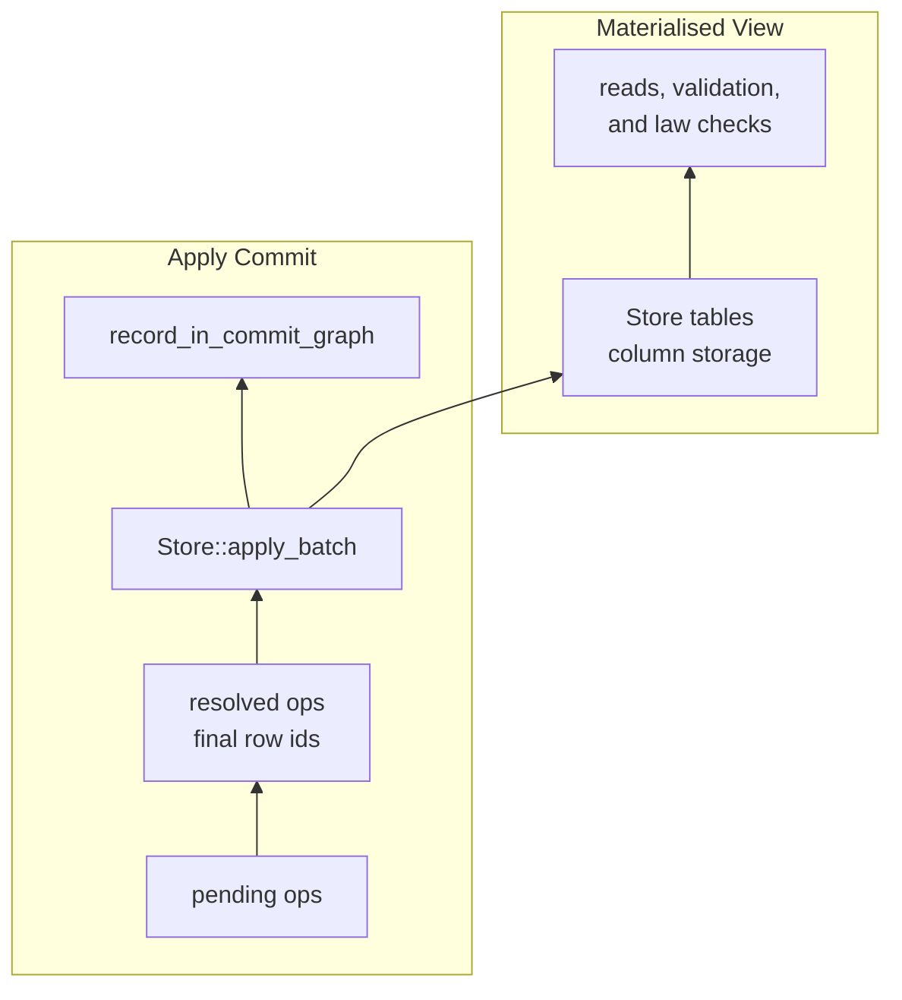

# Commit Layer

This note explains the current commit layer implementation. It is intended for
contributors working on `crates/geomerge/src/commit`, not for external users of
the REPL or store API.

## Commit Graph

A `Store` keeps a `CommitGraph`, which is a DAG of commits. The graph starts with
one special root commit. That root commit is created when a theory is loaded into
a store, and its payload stores the theory-derived table schemas, table ids, and
laws.

Normal commits represent transactions. Each transaction records the current graph
heads as its dependencies, so the next commit points back to the commits it builds
on. A commit stores metadata such as dependencies, timestamp, optional message, and
hash references. Its main data is `pending`, the list of operations produced by
the transaction before their temporary row ids are resolved into final row ids.

## Commit Payloads

Root commits and normal commits use different payload formats:

1. The root commit payload, in `commit/wire/metadata.rs`, serializes table entries
   and laws.
2. A normal commit payload, in `commit/wire/data.rs`, serializes commit metadata
   first, then serializes the commit body.

Across commit payloads and the store envelope, scalar integer fields use strict
LEB128 encoding through `commit/leb128.rs`. Decoders reject overlong encodings so
each integer has a canonical byte representation. Tags remain single raw bytes,
commit hashes remain fixed 32-byte values, and embedded `hexane` columns keep
their own internal encoding.

The normal commit metadata layout is:

```text
[deps_count]
[CommitHash x deps_count]
[author:32 bytes]
[timestamp]
[message_len][message:utf-8]
[other_hash_count][CommitHash x other_hash_count]
[commit body]
```

## Commit Body Encoding

The commit body is where transaction operations are stored. It starts with the
number of operations, a column of operation kinds, a column describing which table
group each operation belongs to, and then one encoded group per table:

```text
[op_count]
[op_kind_column_len][op_kind_column]
[table_sequence_column_len][table_sequence_column]
[group_count]
[op_group_len][op_group] x group_count
```

Operations for the same table are grouped together in first-seen table order. This
lets each table group encode rows in a schema-shaped, columnar form with hexane:
one column blob per schema column. The `table_sequence_column` preserves the
original transaction order, so decoding can interleave rows from the table groups
back into the original operation sequence.

Each operation group starts with `[table_path_len][table_path:utf-8][row_count]`
and `[column_count]`, followed by one LEB128 length-prefixed `hexane` blob per
schema column. Row-reference columns are encoded as two LEB128 length-prefixed
`hexane` subcolumns: hash indexes and row counters.

For example, suppose a transaction contains these operations:

```text
op 0: add Person values ("Ada", 37)
op 1: add Pet values ("Byron", ref(op 0))
op 2: add Person values ("Grace", 85)
```

The first-seen table order is `Person`, then `Pet`, so the body stores:

```text
op_kind_column       = [add, add, add]
table_sequence       = [0, 1, 0]

group 0: table Person
  name column        = ["Ada", "Grace"]
  age column         = [37, 85]

group 1: table Pet
  name column        = ["Byron"]
  owner column       = [ref(op 0)]
```

During decoding, `table_sequence = [0, 1, 0]` means: take the next row from the
`Person` group, then the next row from the `Pet` group, then the next row from the
`Person` group. That reconstructs the same pending operation order the transaction
started with.

## Store Serialization

When the whole store is serialized, `commit/pst.rs` writes a store envelope with
the magic bytes, format version, next table id, and commit count. It then writes
every commit chunk in commit graph topological order. That means parents are
written before children, with the root commit first.

The store envelope layout is:

```text
[magic:4 bytes]
[format_version]
[next_table_id]
[chunk_count]
[chunk_type:u8][payload_len][payload] x chunk_count
```

Loading reverses the process: decode the root, rebuild an empty store from its
schemas and laws, decode the normal commits using those schemas, and apply the
commits once their dependencies are available.

## Tables as Materialised Views

Commit payloads are the stored transaction history. Tables are the materialised
view used for validation, law checking, and reads. When a commit is applied to a
store, `Store::apply_commit_ready` first unpacks the commit into resolved table
operations with `cmt.resolved_ops()`, applies those operations to the tables with
`apply_batch`, and then records the commit in the commit graph.



The important split is that the commit graph keeps the durable sequence of
changes, while the tables keep the current replayed state. Applying the same set
of commits from the root rebuilds the table contents.
